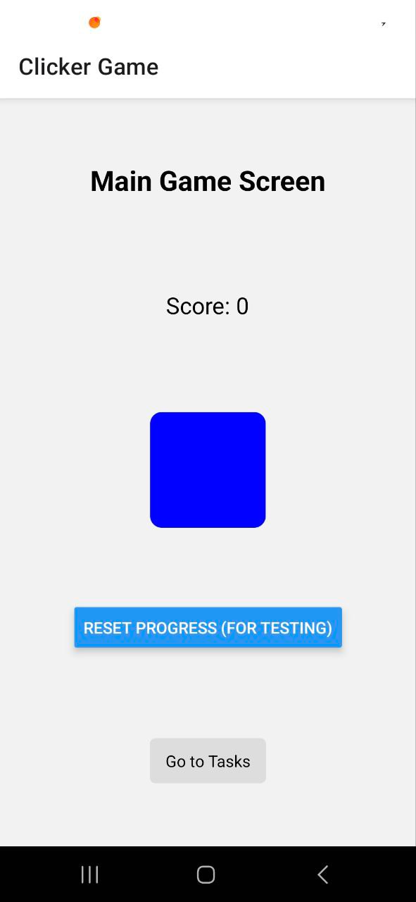
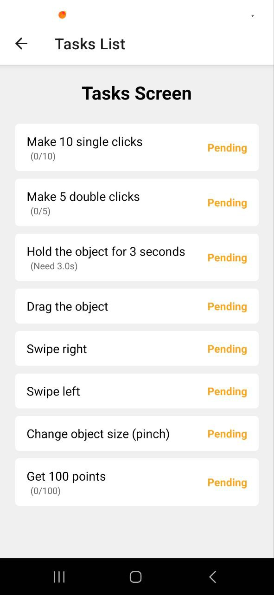
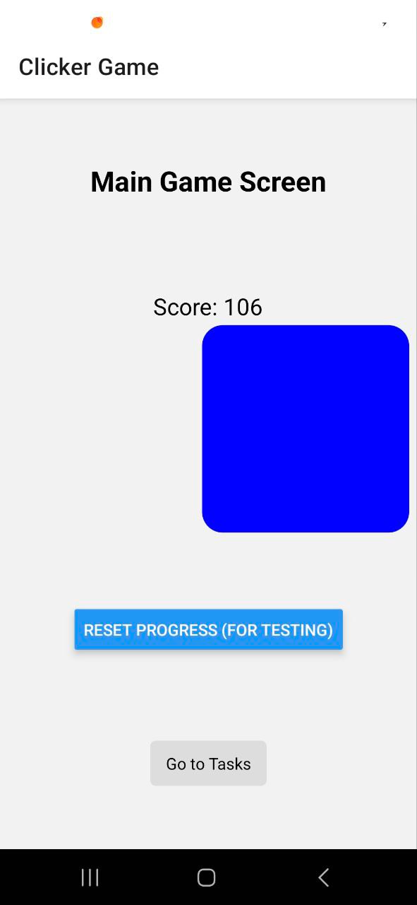
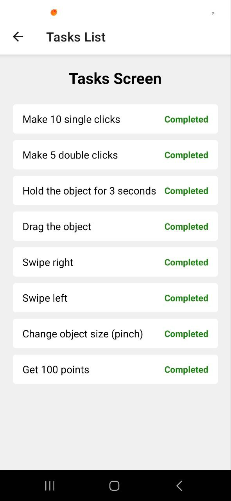

# Lab3: Clicker Game with Tasks

## Overview
Lab3 is an interactive clicker game designed to engage users with various gesture-based tasks. The app combines fun gameplay mechanics with smooth animations and state management, making it a great example of React Native's capabilities.

---

## Features

### 1. Gesture-Based Gameplay
- **Single Tap**: Perform a quick tap to complete tasks. Gives +1 point
- **Double Tap**: Tap twice in quick succession for specific tasks. Gives +2 points
- **Long Press**: Hold down on the screen to trigger long-press actions. Gives +5 points (for 3 seconds)
- **Drag and Drop**: Drag objects to specific targets.
- **Swipe**: Swipe in different directions to complete tasks. (gives random number of points)
- **Pinch**: Use two fingers to pinch in or out for zoom-related tasks.

### 2. Task Management
- A dynamic task list is displayed, showing all available gestures and their progress.
- Tasks are updated in real-time as users perform gestures.
- Completed tasks are marked, and progress is visually represented.

---

## Technical Details

### Libraries and Tools
- **React Native**: Core framework for building the app.
- **React Native Gesture Handler**: For handling complex gestures.
- **React Native Reanimated**: For creating smooth animations.
- **React Context API**: For state management.

### Folder Structure
- **`app/`**: Contains code for 2 main screens in the app
- **`context/`**: Houses the context provider for managing app state.
- **`hooks/`**: Stores a custom hook to reuse clicker gestures.

---

## Screenshots from the app

1. Main screen after first run:

2. Tasks list screen after first run:

3. Main screen after all tasks completed:

4. Tasks screen after all tasks completed:
