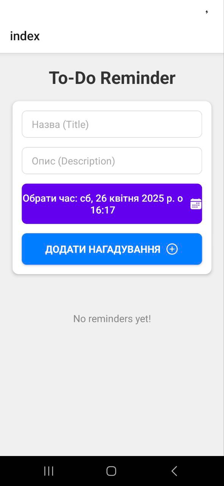
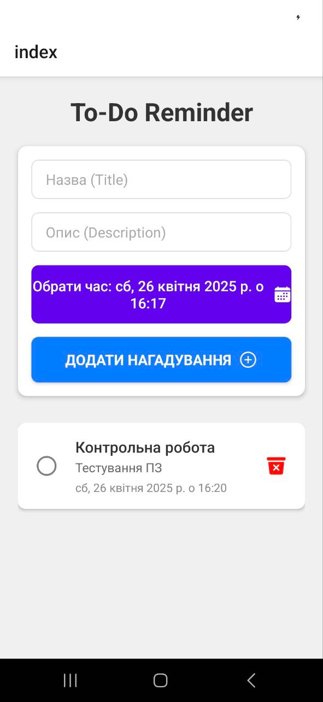
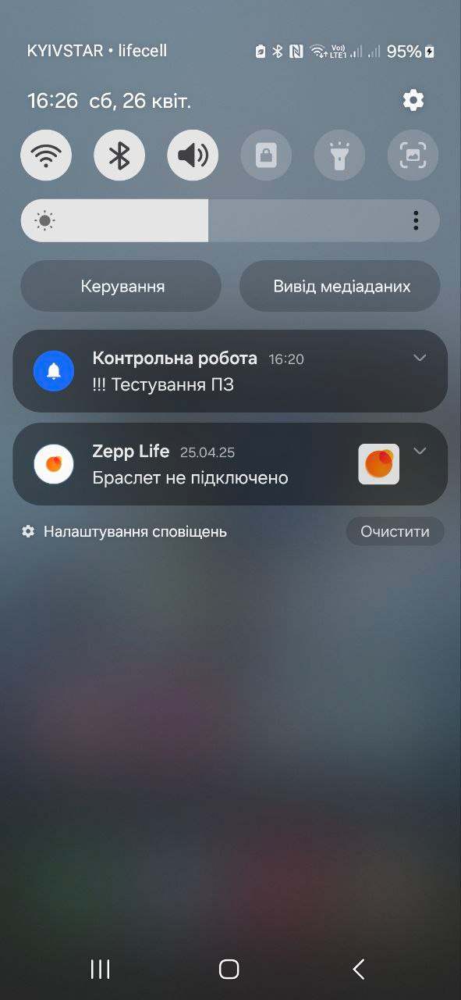
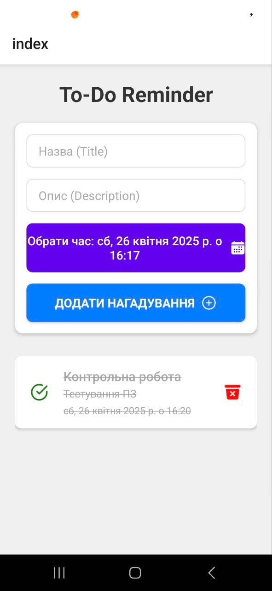
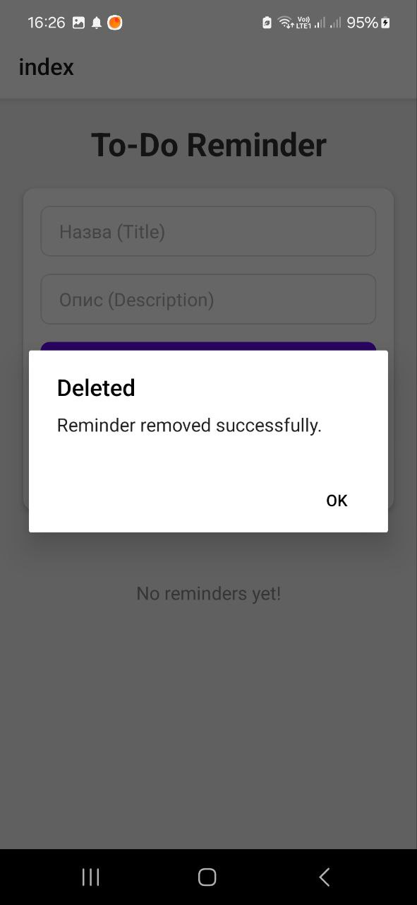

# Lab4: To-Do Reminder App with Notifications

## Overview

Lab4 is a feature-rich to-do reminder app built with React Native and Expo. It allows users to create, manage, and schedule reminders with push notifications. The app integrates with OneSignal to handle notifications and provides a clean, user-friendly interface for managing tasks. It also includes advanced features like date pickers, animations, and state management.

---

## Features

### 1. To-Do List Management

- **Add Reminders**: Users can create reminders with a title, description, and scheduled time.
- **Delete Reminders**: Remove reminders from the list, with optional cancellation of associated notifications.
- **Mark as Completed**: Toggle reminders as completed or incomplete.

### 2. Push Notifications

- **OneSignal Integration**: Notifications are scheduled using OneSignal's API. + Firebase 
- **Custom Notifications**: Each reminder triggers a notification with a custom title and description.
- **Notification Cancellation**: Notifications for deleted or completed reminders can be canceled.

### 3. Date and Time Picker

- **DatePicker Integration**: Users can select a specific date and time for their reminders.
- **Validation**: Ensures that reminders are scheduled for future times only.

---

## Technical Details

### Libraries and Tools

- **React Native**: Core framework for building the app.
- **Expo**: Simplifies development and deployment.
- **OneSignal**: Handles push notifications.
- **React Native Gesture Handler**: For smooth touch interactions.
- **React Native Reanimated**: For animations.
- **React Native Date Picker**: Provides a customizable date and time picker.

### Folder Structure

- **`app/`**: Contains the main application logic, including screens and components.
- **`android/`**: Native Android configurations for the app.
---

## How It Works

### Adding a Reminder

1. Enter a title and optional description for the reminder.
2. Select a date and time using the date picker.
3. Tap the "Add Reminder" button to save the task and schedule a notification.

### Managing Reminders

- **Mark as Completed**: Tap the checkbox to mark a task as completed.
- **Edit Reminder**: Modify the title, description, or time of an existing reminder.
- **Delete Reminder**: Remove a task and optionally cancel its notification.

### Notifications

- Notifications are scheduled using OneSignal's REST API.
- Each notification includes the reminder's title and description.
- Notifications are automatically canceled for completed or deleted tasks.

---

## Screenshots
1. Main screen

2. After adding a To-Do

3. Reminder sent a push notification

4. Completed todo

5. Removed reminder
